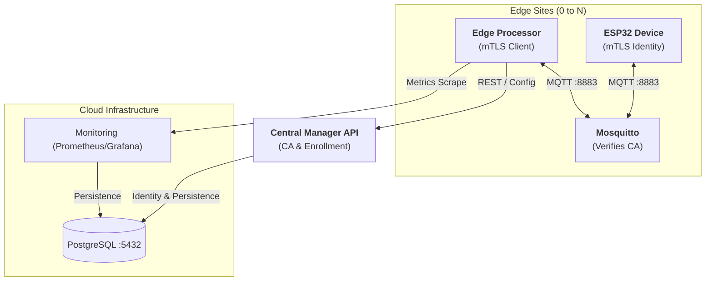
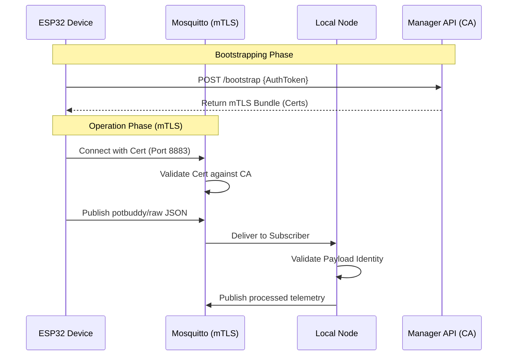

# 🌿 PotBuddy — Attachable IoT Plant Care Device

**Plant Care Group | CPE475**

> An affordable, attachable IoT device that monitors soil moisture, temperature, humidity, and light — then recommends care actions in real time.

---

## 👥 Team

| Name | Student ID |
| :--- | :--- |
| Chonlawat Yongpraderm | 66070503411 |
| Nutthakit Wongviboonsin | 66070503417 |
| Porawat Sithkankiat | 66070503433 |
| Kamin Jittapassorn | 66070503409 |

---

## 📐 System Architecture

PotBuddy implements a **Zero-Trust Multi-Site Edge Architecture** using Mutual TLS (mTLS).



---

## 📊 Data Flow (Zero-Trust)



---

## 🌡️ Health Status Logic

The Local Node classifies each sensor reading independently then rolls up a **worst-case overall status**.

| Sensor | 🟢 Healthy | 🟡 Warning | 🔴 Critical |
| :--- | :---: | :---: | :---: |
| **Soil** (ADC 0–4095) | 1500 – 2500 | 1000–1499 or 2501–3000 | < 1000 or > 3000 |
| **Temperature** (°C) | 18 – 30 | 15–17 or 31–35 | < 15 or > 35 |
| **Humidity** (%) | 40 – 70 | 30–39 or 71–80 | < 30 or > 80 |
| **Light** (lux) | 2000 – 50 000 | 500–1999 or 50 001–80 000 | < 500 or > 80 000 |

---

## 🔐 Security & Enrollment

### 1. Zero-Trust mTLS
Every MQTT client (Go-nodes and ESP32s) must possess a unique, CA-signed certificate. The **Manager API** acts as the Certificate Authority.
- **Port 8883**: Standard mTLS listener on all edge brokers.
- **Identity Mapping**: The Certificate Common Name (CN) is mapped directly to the MQTT username.

### 2. Device Bootstrapping
To solve the factory-default trust problem, devices follow a two-step enrollment:
1. **Admin Enrollment**: Admin registers a `device_id` in the UI and receives a one-time **AuthToken**.
2. **Device Bootstrap**: The device uses the `AuthToken` via HTTPS to download its permanent mTLS certificate bundle (`ca.crt`, `client.crt`, `client.key`).

---

## 🔌 Hardware

### Controller — ESP32-WROOM-32
- **Connectivity**: WiFi + `WiFiClientSecure` for mTLS.
- **Storage**: LittleFS for secure certificate persistence.

### Sensors
- **BH1750**: I2C Light Sensor.
- **DHT11**: Temperature & Humidity.
- **Soil Sensor**: Analog Resistive Probe.

---

## 🚀 Getting Started

Please see our comprehensive **[Deployment Guide](deployment.md)** to launch the project.

### Fleet Simulation (mTLS)
Run the fleet simulator to verify your mTLS infrastructure:
```bash
cd local-node
# Issued via Manager API
export MQTT_CA_FILE="../certs/ca.crt"
export MQTT_CERT_FILE="../certs/client.crt"
export MQTT_KEY_FILE="../certs/client.key"
MQTT_BROKER=ssl://localhost:8883 make simulate
```

---

## progress

- [x] **Phase 1: Core Identity & RBAC** (Google SSO, JWT)
- [x] **Phase 2: Web Enrollment** (Infrastructure monitoring, Config download)
- [x] **Phase 3: mTLS Infrastructure Rollout** (CA Logic, Mosquitto 8883, Go mTLS)
- [ ] **Phase 4: IoT Device Migration** (WiFiManager, ESP32 HTTPS Bootstrap, mTLS MQTT)

---

**PLANT CARE GROUP** — CPE475 | *Thank You!*
