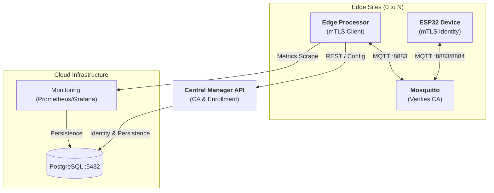
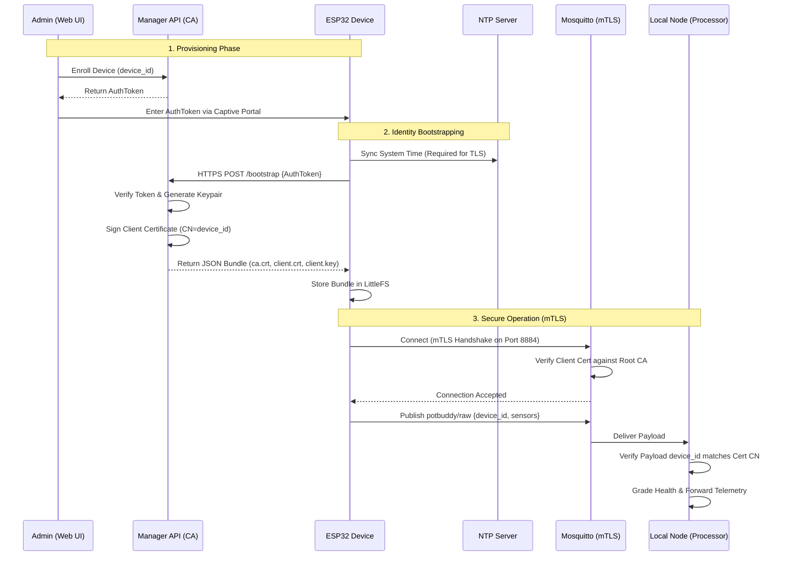

# 🌿 PotBuddy — Attachable IoT Plant Care Device

**Plant Care Group | CPE475**

> An affordable, attachable IoT device that monitors soil moisture, temperature, humidity, and light — then recommends care actions in real time.

---

## 👥 Team

| Name | Student ID |
| :--- | :--- |
| Chonlawat Yongpraderm | 66070503411 |
| Nutthakit Wongviboonsin | 66070503417 |
| Porawat Sithkankiat | 66070503433 |
| Kamin Jittapassorn | 66070503409 |

---

## 📐 System Architecture

PotBuddy implements a **Zero-Trust Multi-Site Edge Architecture** using Mutual TLS (mTLS).



---

## 🔐 Zero-Trust mTLS Implementation

PotBuddy ensures security by treating every component as a potential threat until proven otherwise via cryptographic identity.

### 📊 Secure Bootstrapping & Operation Flow



### 1. Central Certificate Authority (CA)
The **Manager API** serves as the Root CA. Upon startup (if `ENABLE_CA=true`), it generates or loads a persistent Root CA key-pair. It uses this to sign certificates for every device and processing node in the fleet.

### 2. Identity-Based Access Control
- **Common Name (CN)**: Every certificate issued has a unique CN (e.g., `Device-1` or `node-0`).
- **Mosquitto Enforcement**: The broker is configured with `require_certificate true` and `use_identity_as_username true`. This means the broker extracts the device's identity directly from its cryptographically signed certificate, making password-based attacks impossible.

### 3. The Bootstrapping Protocol
To bridge the gap between "factory default" and "fully secure," devices use a one-time bootstrap process:
1. **NTP Sync**: The ESP32 synchronizes its clock with `pool.ntp.org`. mTLS will fail if the device time is incorrect.
2. **Token Exchange**: The device sends a one-time `AuthToken` via HTTPS to the Manager API.
3. **Bundle Retrieval**: The Manager verifies the token and returns a JSON bundle containing:
   - `ca.crt`: The Root CA certificate.
   - `client.crt`: The device's unique signed certificate.
   - `client.key`: The private key for that certificate.
4. **Persistence**: These are stored securely in **LittleFS** on the ESP32.

---

## 🚀 Secure Deployment Guide

### A. Manager API (The CA)
Enable the Certificate Authority by setting the environment variable in your service file or docker-compose:
```bash
# potbuddy-manager.service
Environment=ENABLE_CA=true
```

### B. MQTT Broker (mTLS Listener)
The broker must be reachable on port **8883** (internal) or **8884** (external/forwarded).
1. Generate a server certificate signed by the Manager CA.
2. Update `mosquitto.conf`:
```conf
listener 8883
cafile /etc/mosquitto/certs/ca.crt
certfile /etc/mosquitto/certs/server.crt
keyfile /etc/mosquitto/certs/server.key
require_certificate true
use_identity_as_username true
```

### C. ESP32 Provisioning
1. **Hold BOOT Button**: Press and hold the BOOT button (GPIO 0) for 5 seconds to wipe settings.
2. **Connect to Portal**: Join the `PotBuddy-Setup` WiFi network.
3. **Configure**:
   - `Manager Host`: `manager.kaminjitt.com`
   - `MQTT Host`: `mqtt.kaminjitt.com`
   - `MQTT mTLS Port`: `8884`
   - `Device Auth Token`: (Generated from Dashboard)

---

## 🌡️ Health Status Logic

The Local Node classifies each sensor reading independently then rolls up a **worst-case overall status**.

| Sensor | 🟢 Healthy | 🟡 Warning | 🔴 Critical |
| :--- | :---: | :---: | :---: |
| **Soil** (ADC 0–4095) | 1500 – 2500 | 1000–1499 or 2501–3000 | < 1000 or > 3000 |
| **Temperature** (°C) | 18 – 30 | 15–17 or 31–35 | < 15 or > 35 |
| **Humidity** (%) | 40 – 70 | 30–39 or 71–80 | < 30 or > 80 |
| **Light** (lux) | 2000 – 50 000 | 500–1999 or 50 001–80 000 | < 500 or > 80 000 |

---

## 🔌 Hardware

### Controller — ESP32-WROOM-32
- **Connectivity**: WiFi + `WiFiClientSecure` for mTLS.
- **Security**: Hardware-accelerated SHA/AES + NTP Time Sync.
- **Storage**: LittleFS for certificate persistence.

### Sensors
- **BH1750**: I2C Light Sensor.
- **DHT11**: Temperature & Humidity.
- **Soil Sensor**: Analog Resistive Probe.

---

## 📈 Progress

- [x] **Phase 1: Core Identity & RBAC** (Google SSO, JWT)
- [x] **Phase 2: Web Enrollment** (Infrastructure monitoring, Config download)
- [x] **Phase 3: mTLS Infrastructure Rollout** (CA Logic, Mosquitto 8883, Go mTLS)
- [x] **Phase 4: IoT Device Migration** (WiFiManager, ESP32 HTTPS Bootstrap, mTLS MQTT)

---

**PLANT CARE GROUP** — CPE475 | *Thank You!*
