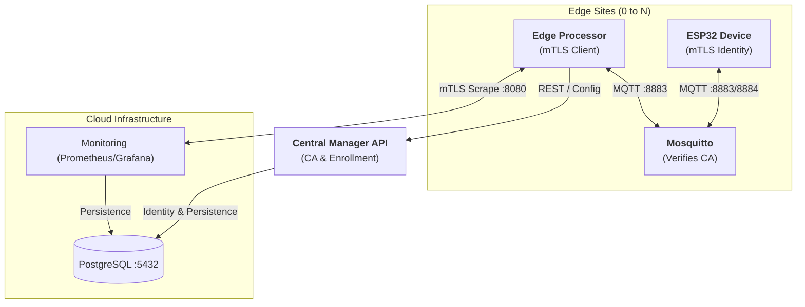
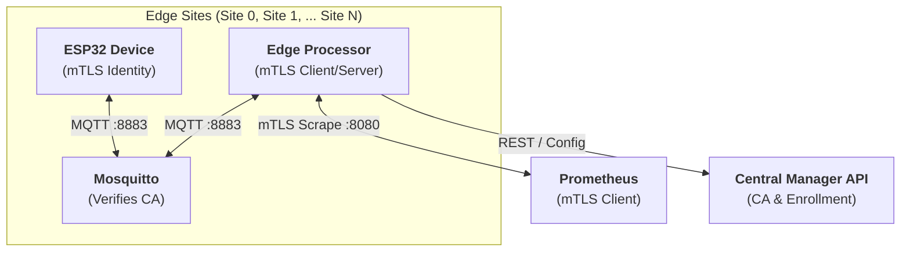

# 🌿 PotBuddy — Attachable IoT Plant Care Device

**Plant Care Group | CPE475**

> An affordable, attachable IoT device that monitors soil moisture, temperature, humidity, and light — then recommends care actions in real time.

---

## 👥 Team

| Name | Student ID |
| :--- | :--- |
| Chonlawat Yongpraderm | 66070503411 |
| Nutthakit Wongviboonsin | 66070503417 |
| Porawat Sithkankiat | 66070503433 |
| Kamin Jittapassorn | 66070503409 |

---

## 📐 System Architecture

PotBuddy implements a **Zero-Trust Multi-Site Edge Architecture** using Mutual TLS (mTLS).



---

## 🔐 mTLS Implementation

PotBuddy ensures security by treating every component as a potential threat until proven otherwise via cryptographic identity.

### 📊 Secure Bootstrapping & Operation Flow



### 1. Central Certificate Authority (CA)
The **Manager API** serves as the Root CA. It dynamically generates two types of identities:
- **Client Identities**: For ESP32 devices, Edge Processors, and the Prometheus Scraper.
- **Server Identities**: For Mosquitto brokers and Local Node APIs, including SANs for hostnames.

### 2. Multi-Site Distributed Security
PotBuddy is proven in production across multiple physical sites:
- **Site 0**: Operational at `mqtt-0.iot.kaminjitt.com`.
- **Site 1**: Operational at `mqtt-1.iot.kaminjitt.com`.
Every broker uses strict mTLS, mapping certificate identities to MQTT usernames automatically.

### 3. Monitoring & Scraper Security (mTLS)
To achieve true **Zero-Trust**, the Local Node HTTP API (Port 8080) is secured using the same Root CA:
- **mTLS Required**: The `/metrics` endpoint rejects any connection without a CA-signed certificate.
- **Infrastructure Identity**: Prometheus is enrolled as a secure client, using its own identity bundle to authenticate against edge nodes.

---

## 🚀 Secure Deployment Guide

### A. Manager API (The CA)
Enable the Certificate Authority by setting the environment variable:
```bash
Environment=ENABLE_CA=true
```

### B. MQTT Broker (mTLS Listener)
To secure a new site broker (e.g., Site 2):
1. **Enroll**: Add the site in the **Enrollment** tab of the Dashboard.
2. **Download Server Bundle**: Click the **Shield icon** (🛡️) next to the site to download `broker-id-cert-bundle.json`.
3. **Unpack & Configure**: Use `jq` to extract `ca.crt`, `server.crt`, and `server.key` into `/etc/mosquitto/certs/`.
4. **Mosquitto**: Enable the port 8883 listener with `require_certificate true`.

### C. Edge Processor (Local Node)
1. **Download Node Bundle**: In the **Enrollment** tab, click the **Download icon** (📥) to get `node-id-config-bundle.json`.
2. **Deploy**: Extract the `config.yaml` and mTLS certificates to the edge server.
3. **Run**: Start the `local-node` binary. It serves HTTPS with mTLS on port 8080 and connects to the local broker on 8883.

### D. Prometheus Scraper
1. **Generate Scraper Identity**: Enroll "Prometheus" as a node in the Manager UI.
2. **Configure Scrape Job**:
   ```yaml
   - job_name: 'potbuddy-local-node'
     scheme: https
     tls_config:
       ca_file: /etc/prometheus/certs/ca.crt
       cert_file: /etc/prometheus/certs/prometheus.crt
       key_file: /etc/prometheus/certs/prometheus.key
     static_configs:
       - targets: ['site-hostname:8080']
   ```

---

### C. ESP32 Provisioning
1. **Hold BOOT Button**: Press and hold the BOOT button (GPIO 0) for 5 seconds to wipe settings.
2. **Connect to Portal**: Join the `PotBuddy-Setup` WiFi network.
3. **Configure**:
   - `Manager Host`: `manager.iot.kaminjitt.com`
   - `MQTT Host`: `(MQTT Broker Address from Dashboard)`
   - `MQTT mTLS Port`: `8883`
   - `Device Auth Token`: (Generated from Dashboard)

> **⚠️ Critical Note**: ESP32 devices require a working internet connection to sync time via **NTP** before connecting. If the device clock is incorrect, mTLS handshakes with the MQTT broker will fail.

---

## 🌡️ Health Status Logic

The Local Node classifies each sensor reading independently then rolls up a **worst-case overall status**.

| Sensor | 🟢 Healthy | 🟡 Warning | 🔴 Critical |
| :--- | :---: | :---: | :---: |
| **Soil** (ADC 0–4095) | 1500 – 2500 | 1000–1499 or 2501–3000 | < 1000 or > 3000 |
| **Temperature** (°C) | 18 – 30 | 15–17 or 31–35 | < 15 or > 35 |
| **Humidity** (%) | 40 – 70 | 30–39 or 71–80 | < 30 or > 80 |
| **Light** (lux) | 2000 – 50 000 | 500–1999 or 50 001–80 000 | < 500 or > 80 000 |

---

## 🔌 Hardware

### Controller — ESP32-WROOM-32
- **Connectivity**: WiFi + `WiFiClientSecure` for mTLS.
- **Security**: Hardware-accelerated SHA/AES + NTP Time Sync.
- **Storage**: LittleFS for certificate persistence.

### Sensors
- **BH1750**: I2C Light Sensor.
- **DHT11**: Temperature & Humidity.
- **Soil Sensor**: Analog Resistive Probe.

---

## 📈 Progress

- [x] **Phase 1: Core Identity & RBAC** (Google SSO, JWT)
- [x] **Phase 2: Web Enrollment** (Infrastructure monitoring, Config download)
- [x] **Phase 3: mTLS Infrastructure Rollout** (CA Logic, Mosquitto 8883, Go mTLS)
- [x] **Phase 4: IoT Device Migration** (WiFiManager, ESP32 HTTPS Bootstrap, mTLS MQTT)

---

**PLANT CARE GROUP** — CPE475 | *Thank You!*
