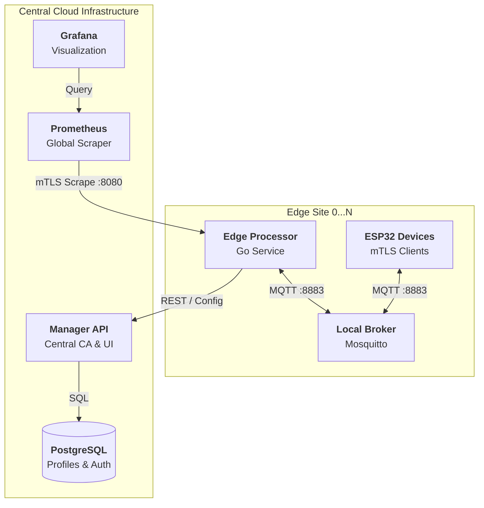
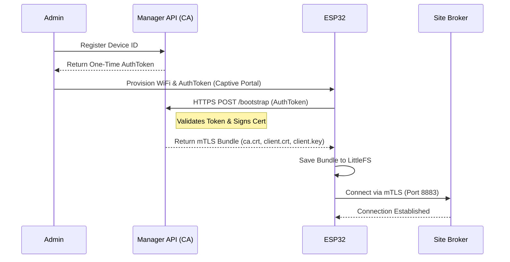
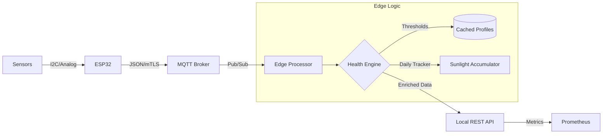
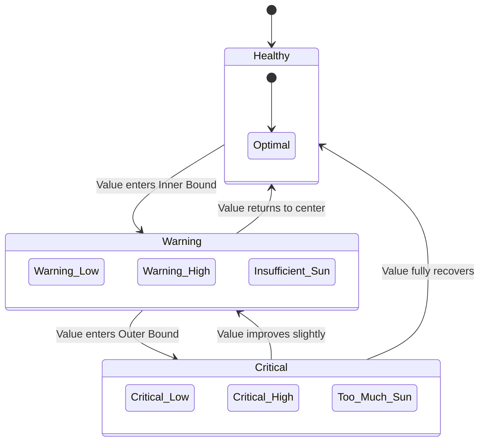

# 🌿 PotBuddy — Enterprise IoT Plant Care Fleet

**Plant Care Group | CPE475**

- [🚀 Deployment Guide](deployment.md)
- [🧪 Test Cases](testcases/testcases.md)

> An affordable, attachable IoT solution for large-scale plant monitoring. Features Zero-Trust security, multi-site distributed processing, and real-time health analytics.

---

## 👥 Team

| Name | Student ID |
| :--- | :--- |
| Chonlawat Yongpraderm | 66070503411 |
| Nutthakit Wongviboonsin | 66070503417 |
| Porawat Sithkankiat | 66070503433 |
| Kamin Jittapassorn | 66070503409 |

---

## 📐 System Architecture

PotBuddy implements a **Zero-Trust Multi-Site Edge Architecture**. The system scales to **N physical sites**, each operating its own local infrastructure while reporting to a central management plane.

### 🌐 Deployment Topology


---

## 🔐 Zero-Trust Security (mTLS)

We utilize a custom Certificate Authority (CA) built into the Manager API to issue unique cryptographic identities. No component is trusted unless it presents a valid, CA-signed certificate.

### 🔄 Device Bootstrapping Sequence
How a "factory-fresh" device transitions from unsecured to Zero-Trust.



---

## 🌡️ Plant Health Logic

The system evaluates sensor data against dynamic thresholds defined in "Health Profiles".

### 📊 Interaction & Data Flow


### 📈 Health State Machine
Status transitions based on boundary violations.



---

## ☀️ Sunlight Exposure Tracking

The Local Node features a high-fidelity sunlight tracker to prevent "instantaneous" light alerts from triggering during night cycles.

- **Throttle:** Exposure increments at most **once per minute**.
- **Direct Sun:** Counts when `lux > DirectThreshold` (Profile-specific).
- **Indirect Sun:** Counts when `500 < lux < DirectThreshold`.
- **Rollover:** Daily counters reset at **Midnight (BKK Time)**.
- **Alerts:** 
    - *Too Much:* Triggered immediately if `DirectMinutes` exceeded.
    - *Insufficient:* Evaluated at **Sunset (18:00)** against `MinTotalMinutes`.

---

## 🚀 Secure Deployment Guide

### 1. Central Infrastructure
1.  Deploy **PostgreSQL** and run `init.sql`.
2.  Start **Manager API** with `ENABLE_CA=true`.
3.  Invite Users via the **Users** tab (Google SSO required).

### 2. Edge Site Setup
1.  **Enroll Site:** Create a node in the Dashboard to get a **Site Token**.
2.  **Enroll Broker:** 
    ```bash
    ./enroll -type mqtt -token <TOKEN> -cn <BROKER_IP>
    ```
3.  **Enroll Processor:**
    ```bash
    ./enroll -token <TOKEN>
    ```
4.  **Launch:** Deploy generated `mosquitto.conf` and `config.yaml`.

---

## 🔌 Hardware Specs

### ESP32-WROOM-32
- **mTLS:** Hardware-accelerated RSA/AES via `WiFiClientSecure`.
- **Time:** NTP sync required for certificate validity.
- **Storage:** LittleFS used for secure credential persistence.

### Sensors
- **BH1750:** Digital I2C Light Sensor (High Res).
- **DHT11:** Temperature & Humidity.
- **Soil:** Capacitive/Resistive Analog Probe.

---