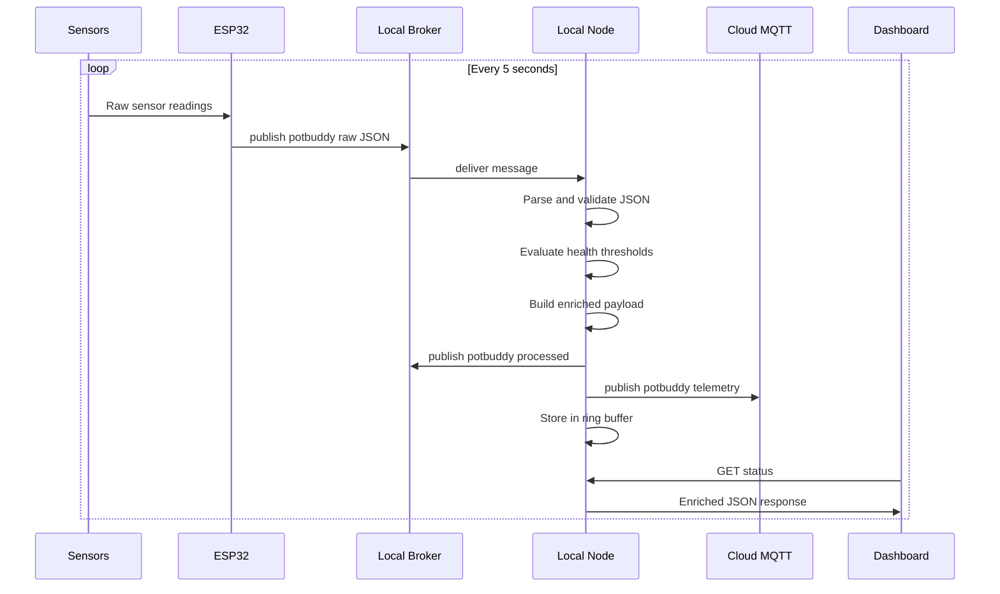
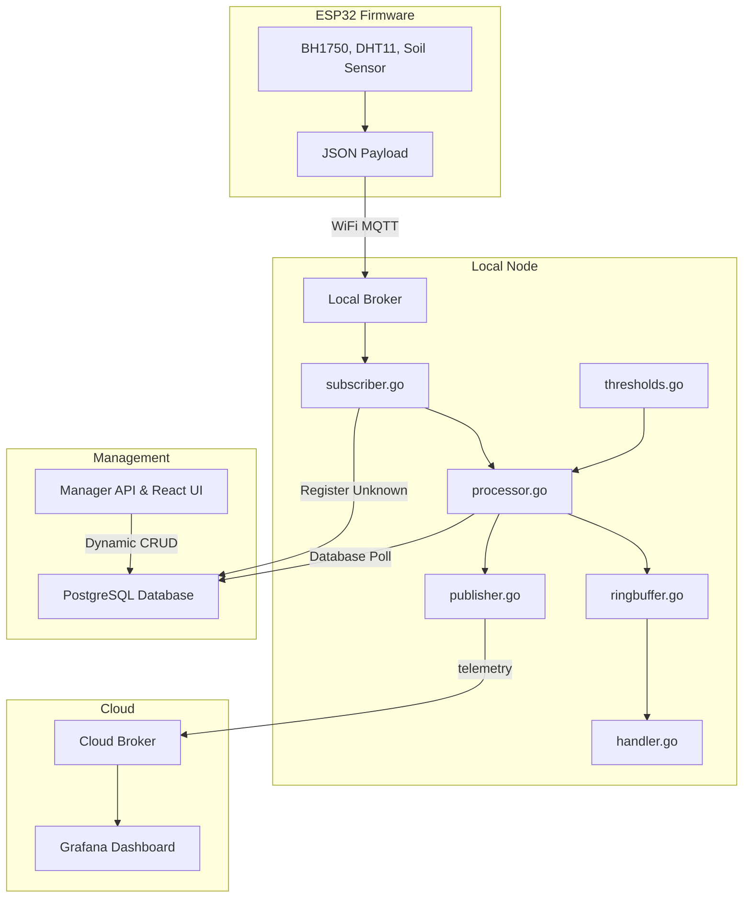
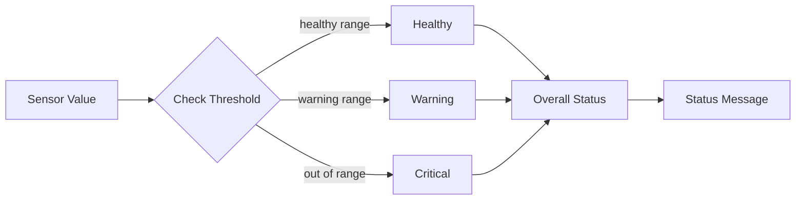

# 🌿 PotBuddy — Attachable IoT Plant Care Device

**Plant Care Group | CPE475**

> An affordable, attachable IoT device that monitors soil moisture, temperature, humidity, and light — then recommends care actions in real time.

---

## 👥 Team

| Name | Student ID |
| :--- | :--- |
| Chonlawat Yongpraderm | 66070503411 |
| Nutthakit Wongviboonsin | 66070503417 |
| Porawat Sithkankiat | 66070503433 |
| Kamin Jittapassorn | 66070503409 |

---

## 📐 System Architecture

PotBuddy implements a **Multi-Site Edge Architecture**.

```
┌─────────────────────────────────────────────────────────────────────┐
│                          PotBuddy System                            │
│                                                                     │
│  ┌──────────────────┐     MQTT      ┌────────────────────────────┐  │
│  │   ESP32 Device   │  potbuddy/raw │Site-x Edge Processor (Node)│  │
│  │     (Site 0)     │ ─────────────>│                            │  │
│  │  • BH1750 Light  │               │  • Subscribe potbuddy/raw  │  │
│  │  • DHT11 Temp    │               │  • Apply cached Thresholds │  │
│  │  • Soil Sensor   │               │  • Export Prometheus Metric│  │
│  │  • WiFi MQTT     │               │  • Target: debian-0 / 1    │  │
│  └──────────────────┘               └────────────┬─────────┬─────┘  │
│                                                  │         │        │
│                                     ┌────────────▼──────┐  │        │
│                                     │ Central Manager   │  │ Prom   │
│                                     │ API & Web React UI│  │ Scrape │
│                                     └────────────┬──────┘  │        │
│                                                  │         │        │
│                                     ┌────────────▼─────────▼─────┐  │
│                                     │     Cloud Integrations     │  │
│                                     │ • PostgreSQL (:5432)       │  │
│                                     │ • Prometheus & Grafana     │  │
│                                     └────────────────────────────┘  │
└─────────────────────────────────────────────────────────────────────┘
```

---

## 📊 Data Flow



---

## 🧩 Component Diagram (Local Node)



---

## 🌡️ Health Status Logic

The Local Node classifies each sensor reading independently then rolls up a **worst-case overall status**.

| Sensor | 🟢 Healthy | 🟡 Warning | 🔴 Critical |
| :--- | :---: | :---: | :---: |
| **Soil** (ADC 0–4095) | 1500 – 2500 | 1000–1499 or 2501–3000 | < 1000 or > 3000 |
| **Temperature** (°C) | 18 – 30 | 15–17 or 31–35 | < 15 or > 35 |
| **Humidity** (%) | 40 – 70 | 30–39 or 71–80 | < 30 or > 80 |
| **Light** (lux) | 2000 – 50 000 | 500–1999 or 50 001–80 000 | < 500 or > 80 000 |



---

## 🔌 Hardware

### Controller — ESP32-WROOM-32

| Feature | Detail |
| :--- | :--- |
| Connectivity | Built-in 2.4 GHz WiFi (802.11 b/g/n) |
| ADC | 12-bit, pins 32–39 |
| I2C | SDA = GPIO 21, SCL = GPIO 22 |
| Power | 3.3 V logic, USB-powered |

### Sensors

| Sensor | Protocol | GPIO | Measures |
| :--- | :---: | :---: | :--- |
| BH1750 (light) | I2C | SDA 21 / SCL 22 | Lux (0 – 65535) |
| DHT11 (temp + hum) | 1-Wire | GPIO 27 | °C and % RH |
| Resistive soil sensor | Analog | GPIO 36 | ADC 0 – 4095 |

---

## ⚙️ Configuration

### `Project/config.h` — ESP32 Firmware

```c
#define WIFI_SSID               "YourNetwork"
#define WIFI_PASSWORD           "YourPassword"
#define MQTT_BROKER             "192.168.1.XXX"   // ← your Local Node LAN IP
#define MQTT_PORT               1883
#define MQTT_CLIENT_ID          "esp32wroom-project"
#define MQTT_TOPIC              "potbuddy/raw"
#define TELEMETRY_FREQUENCY_MS  5000              // publish interval (ms)
```

### `local-node/config.yaml` — Go Service

```yaml
local_mqtt:
  broker: "tcp://localhost:1883"
  sub_topic: "potbuddy/raw"
  pub_topic: "potbuddy/processed"

cloud_mqtt:
  broker: "tcp://mqtt.kaminjitt.com:1883"
  pub_topic: "potbuddy/telemetry"
  username: ""
  password: ""

http:
  port: 8080

store:
  buffer_size: 100     # keep last 100 readings in RAM

device_id: "esp32wroom-project"
```

All fields can be overridden with environment variables:

| Env Var | Overrides | Component |
| :--- | :--- | :--- |
| `LOCAL_BROKER` | `local_mqtt.broker` | Local Node |
| `CLOUD_BROKER` | `cloud_mqtt.broker` | Local Node |
| `CLOUD_MQTT_USER` | `cloud_mqtt.username` | Local Node |
| `CLOUD_MQTT_PASS` | `cloud_mqtt.password` | Local Node |
| `DB_DSN` | `database.dsn` | Local Node / Manager |
| `DEVICE_ID` | `device_id` | Local Node |
| `CONFIG_PATH` | path to config file | Local Node |
| `PORT` | listening port | Manager API |

---

## 🚀 Getting Started

Please see our comprehensive **[Deployment Guide](deployment.md)** to launch the project.

It includes instructions for both:
1. **Docker Compose** (for simple local evaluation)
2. **Multiple-Site Linux Services** (our recommended distributed SSH configuration)

### 3 — Simulate Multi-Device Fleet

Once configured and deployed, you can verify your nodes and dashboard by running the fleet simulator. This mimics three different plants in various environments simultaneously:

```bash
cd local-node
MQTT_BROKER=tcp://mqtt-0.iot.kaminjitt.com:1883 make simulate
```

**Simulated Hardware Nodes:**

| Device ID | Scenario Highlights |
| :--- | :--- |
| `plant-living-room` | Cycles between **Normal** 🟢 and **Dry Soil** 🔴. |
| `plant-balcony` | Cycles through **Bright Sun** 🟡, **Normal**, and **Deep Shade** 🔴. |
| `plant-bedroom` | Low light environment, includes a **DHT11 Sensor Error** scenario. |

---

## 🌐 HTTP API Reference

Base URL: `http://localhost:8080`

### `GET /health`
Liveness probe.

**Response `200 OK`:**
```json
{ "status": "ok" }
```

---

### `GET /status`
Returns the latest enriched sensor reading.

**Response `200 OK`:**
```json
{
  "device_id": "esp32wroom-project",
  "timestamp": "2026-04-17T01:00:00Z",
  "raw": {
    "light": 3200,
    "temp": 27,
    "hum": 55,
    "soil": 1900
  },
  "status": {
    "overall": "healthy",
    "light": "healthy",
    "temp": "healthy",
    "hum": "healthy",
    "soil": "healthy"
  },
  "message": "Plant is healthy today 🌱"
}
```

**Response `503 Service Unavailable`** (no data yet):
```json
{ "error": "no data yet — waiting for first sensor reading" }
```

---

### `GET /history?n=20`
Returns the last `n` readings in chronological order (oldest first). Max `n` = 100, default = 20.

**Response `200 OK`:** JSON array of enriched payloads (same schema as `/status`).

---

### `GET /metrics`
Prometheus scrape endpoint. Exposes real-time gauges for all sensors and health statuses.

**Metrics Exported:**
- `potbuddy_light_lux`: Ambient light level.
- `potbuddy_temperature_celsius`: Air temperature.
- `potbuddy_humidity_percent`: Air humidity.
- `potbuddy_soil_raw`: Raw soil moisture ADC value.
- `potbuddy_health_status`: 0=Healthy, 1=Warning, 2=Critical (labels: `device`, `field`).
- `potbuddy_device_online`: 1 if active, 0 if silent for >30s.

---

## 🏗️ Manager API Reference

Base URL: `http://localhost:8081`

### `GET /api/profiles`
Returns all logic profiles (thresholds).

### `POST /api/profiles`
Creates a new threshold profile.

### `PUT /api/profiles/{id}`
Updates an existing profile.

### `GET /api/devices`
Returns all discovered devices and their assigned profiles.

### `PUT /api/devices/{id}`
Binds a device to a specific profile ID.

### `GET /api/infrastructure`
Returns the connectivity status of all core services (DB, MQTT, Nodes).

---

## 📡 MQTT Topics

| Topic | Direction | Publisher | Subscriber | Payload |
| :--- | :---: | :--- | :--- | :--- |
| `potbuddy/raw` | → Local | ESP32 | Local Node | `{"light":…,"temp":…,"hum":…,"soil":…}` |
| `potbuddy/processed` | → Local | Local Node | Dashboard / debug | Full enriched JSON |
| `potbuddy/telemetry` | → Cloud | Local Node | Cloud Dashboard | Full enriched JSON |

---

## 🧪 Running Tests

```bash
cd local-node
make test
```

```
=== RUN   TestEnrich_AllHealthy             --- PASS
=== RUN   TestEnrich_DrySoil_Critical       --- PASS
=== RUN   TestEnrich_HotDay_Warning         --- PASS
=== RUN   TestEnrich_Dark_Critical          --- PASS
=== RUN   TestEnrich_DHTError_MissingFields --- PASS
=== RUN   TestParse_ValidJSON               --- PASS
=== RUN   TestParse_InvalidJSON             --- PASS
=== RUN   TestEnrichedPayload_JSONRoundTrip --- PASS
PASS   ok  internal/processor  8/8
```

---

## 🗺️ Progress

- [x] **Circuit Design & Component Selection** (ESP32-WROOM, BH1750, DHT11, Soil Sensor)
- [x] **Firmware Development**
    - [x] WiFi & MQTT connection logic
    - [x] Sensor data acquisition (Light, Temp, Humidity, Soil)
    - [x] Telemetry serialization (JSON)
- [x] **Data Connectivity**
    - [x] MQTT Broker setup (mqtt.kaminjitt.com)
    - [x] End-to-end data verification (ESP32 → Broker)
- [x] **Local Node Bridge (Pre-processing)**
    - [x] Go implementation for stability
    - [x] Pre-processing logic (Healthy / Warning / Critical)
    - [x] MQTT Data bridging (Local → Cloud)
    - [x] Simulation test cases
- [x] **Cloud Dashboard**
    - [x] Real-time data visualization
    - [x] Historical data charts
- [x] **Plant Care Logic**
    - [x] Implement Health Status thresholds via Postgres profiles
    - [x] Dynamic React Management Dashboard (Manager API)
    - [ ] Email / Notification system
- [ ] **Physical Prototype**
    - [ ] Case design for "Attachable" feature
    - [ ] Power management (Battery / USB)

---

## 🔮 Future Integration

- **Auto-water system** — Self-watering based on soil moisture threshold.
- **pH Monitoring** — Real-time pH sensor data for actionable care instructions.
- **AI Integration** — Analyze plant health patterns and growth predictions.

---

**PLANT CARE GROUP** — CPE475 | *Thank You!*
